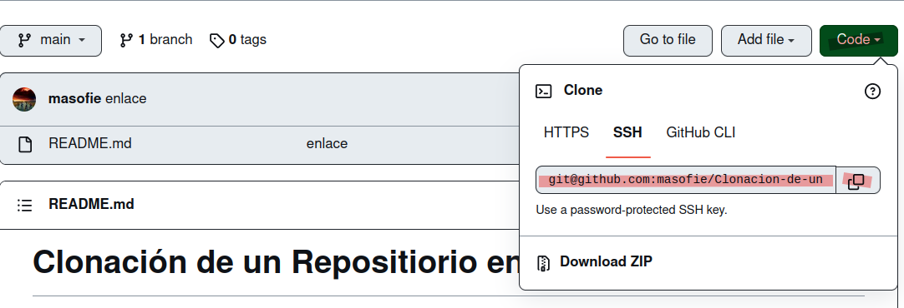
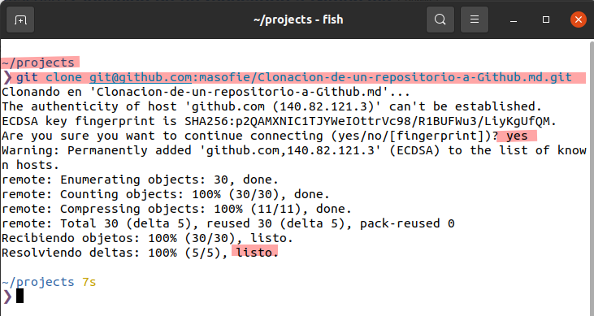

# Clonación de un Repositiorio en Github

Lo primero que hay que saber es que la clonación la vamos a utilizar para poder acceder a nuestro repositorio 
en cualquien lugar donde estemos .

Osea trabajar desde otro lugar , donde originalmente no se ha hecho el trabajo .Si quieres saber mas sobre la clonacion puedes consultar al siguiente enlace : 

**Enlace** : (**https://docs.github.com/es/repositories/creating-and-managing-repositories/cloning-a-repository**)

## Pasos a seguir para la Clonación 

#### Posicionamiento y Crer directorio

Lo primero que hay que hacer es posicionarmos en nuestra carpeta de Github . Y creamos un directorio con el nombre que quireas .

**`mkdir "nombre de la carpeta"`**

#### Copiar enlace en Github 

Para la clonacion lo primero que hay que hacer es ir a nuestro repositorio en Github y copiamos nuestro enlace .

#### Comando para la clonacion 

Después ejecutamos el siguiente comando para clonar nuestro repositorio de Github

**`git clone "enlace copiado anteriormente"`**

## Clonación creada 

Como podemos ver se ha clonado correctamente el repositorio . Para eso utilizamos los siguientes comandos .

Hacemos un **`ls`** ; para ver lo que hay en el directorio.
Después nos vammos al repositorio con el comando **`cd "directorio"`**