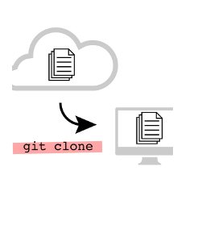
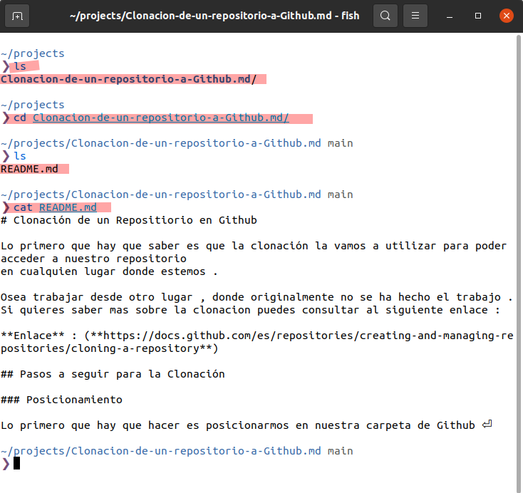
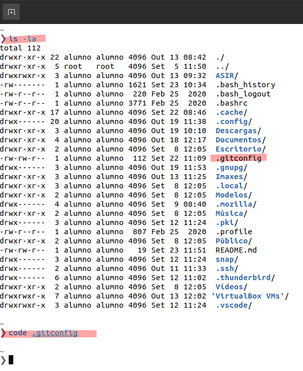
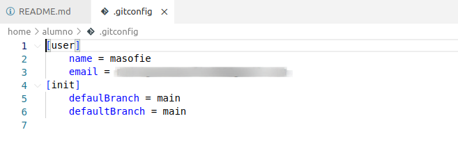

# 📥 Clonación de un Repositorio en ``GitHub``
 

- [📥 Clonación de un Repositorio en ``GitHub``](#-clonación-de-un-repositorio-en-github)
  - [🛠️ 1. Pasos a seguir para la Clonación](#️-1-pasos-a-seguir-para-la-clonación)
    - [📁 1.1 Posicionamiento y crear directorio](#-11-posicionamiento-y-crear-directorio)
    - [🔗 1.2 Copiar el enlace del repositorio](#-12-copiar-el-enlace-del-repositorio)
    - [🧬 1.3 Comando para clonar el repositorio](#-13-comando-para-clonar-el-repositorio)
    - [1.4 ✅ Clonación creada correctamente](#14--clonación-creada-correctamente)
  - [⚙️ Configuración de los Parámetros Globales en Git](#️-configuración-de-los-parámetros-globales-en-git)

 

Lo primero que debemos saber es que la clonación nos permite acceder a nuestro repositorio de **GitHub** desde cualquier lugar , no solo desde el equipo donde lo creamos originalmente.

🧳 Esto es útil para trabajar en distintos ordenadores o compartir tu código fácilmente.

 

🔎 Si quieres saber más sobre la clonación de repositorios en **GitHub** , consulta el siguiente enlace :

[👉 Documentación oficial - Clonar un repositorio](https://docs.github.com/es/repositories/creating-and-managing-repositories/cloning-a-repository)

  

## 🛠️ 1. Pasos a seguir para la Clonación
 

### 📁 1.1 Posicionamiento y crear directorio
 

Primero , nos posicionamos en nuestra carpeta donde gestionamos los proyectos de **GitHub** y creamos un nuevo directorio :

~~~~
mkdir "nombre-de-la-carpeta"
~~~~

  

### 🔗 1.2 Copiar el enlace del repositorio
 

Vamos a **GitHub** , entramos en el repositorio que queremos clonar y copiamos el enlace (botón verde Code → ``HTTPS`` o ``SSH``).

  

### 🧬 1.3 Comando para clonar el repositorio
 

Luego , ejecutamos el comando :

~~~~
git clone "enlace-copiado-anteriormente"
~~~~

  

### 1.4 ✅ Clonación creada correctamente
 

💡 Como puedes ver, el repositorio ya está completamente clonado y listo para trabajar.

~~~~
ls                  # Para ver el contenido del directorio
cd nombre-del-repo  # Entramos al repositorio clonado
cat README.md       # Mostramos el contenido del README
~~~~

  

## ⚙️ Configuración de los Parámetros Globales en Git
 

Git guarda configuraciones globales en un archivo oculto llamado ``.gitconfig`` .

1 - 🧭 Abrir archivo de configuración : 
 

  - Nos dirigimos a nuestra carpeta personal (home).

  - Ejecutamos el siguiente comando para abrir el archivo con VS Code:

~~~~
code .gitconfig
~~~~
  

2 - 📌 Si no ves el archivo , puedes listarlo junto con los ocultos usando :

~~~~
ls -la
~~~~

  

3 - 📝 Archivo ``.gitconfig`` en Visual Studio Code

Este comando abrirá el archivo de configuración global de Git directamente en ``VS Code`` . Ahí podrás modificar parámetros como tu nombre de usuario o correo asociado.

~~~~
[user]
    name = nombre_usuario
    email = user@ejemplo.com
[init]
    defaultBranch = main
    defaultBranch = main
~~~~

